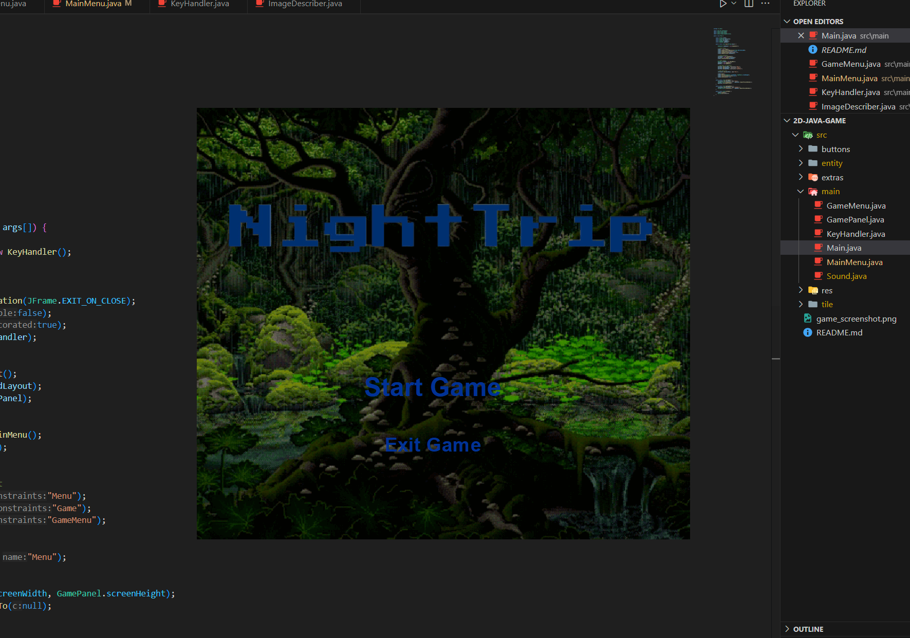

# 2D-Java-Game

#2D java game
This repository serves as the foundation for a game I'm developing. It includes core game logic and can be used as a sandbox for your own game projects.

🚀 Features
🎭 Character Movement – Basic movement logic with smooth 7-frame animations per direction.

📜 Game Menu – A menu with placeholder images, text, and interactive buttons.

⏳ Frame Rate Control – An in-game timer to manage frame rates.

⌨️ Input Handling – Processes key inputs for movement and interactions.

🛠 Setup Instructions
1️⃣ Prerequisites
Ensure you have the following installed:

Java Development Kit (JDK 17+)

2️⃣ Clone the Repository
bash
Copy
Edit
git clone https://github.com/EliA437/2D-Java-Game
cd game-sandbox  

📸 Development Progress
🏗️ Early Foundations

🎨 Game Menu
